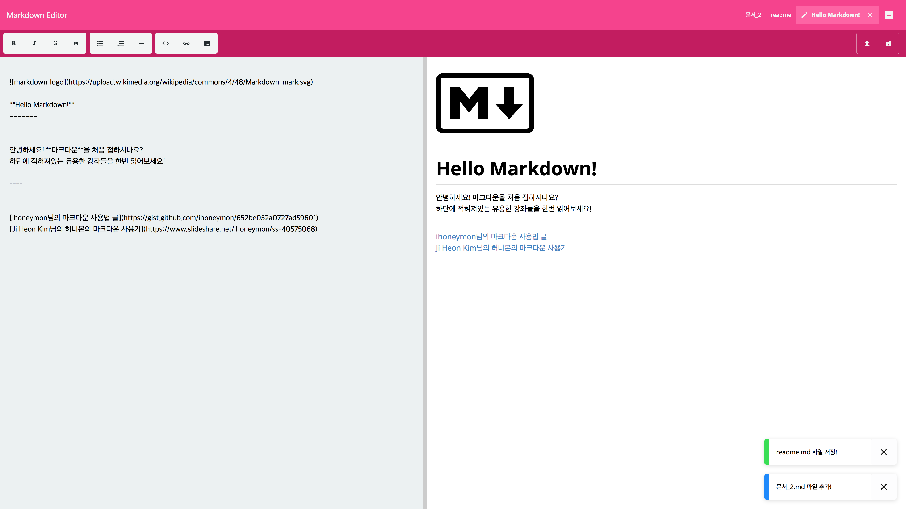

Markdown Editor
===
  

무겁지않고~~(...?)~~ 심플한 react 마크다운 에디터 입니다.  

---

### 기능
---
1. 실시간 프리뷰 지원
2. 에디터창과 프리뷰 화면 크기 조절 지원
3. 에디터 툴바 지원
4. 다중 문서기능 지원
5. md(markdown)파일 저장 불러오기 지원
6. 자동 저장기능 지원
7. ~~초심자를 위한 마크다운 사용법 링크 첨부 (?!)~~ 

---

### 사용한 라이브러리(Library)
---
>react  
react-redux  
react-splitter-layout  
react-motion  
react-notipoix3  
redux  
redux-localstorage  
redux-devtools-extension  
marked  
babel  
webpack  
sass  
lodash  
etc...

---

### 테스트 브라우저
---
| chrome | safari | IE | Firefox |  
|---|---|---|---|
| o | x (**error**) 수정 필요 | ? | x (ㅠㅠㅠㅠ..) |
---
